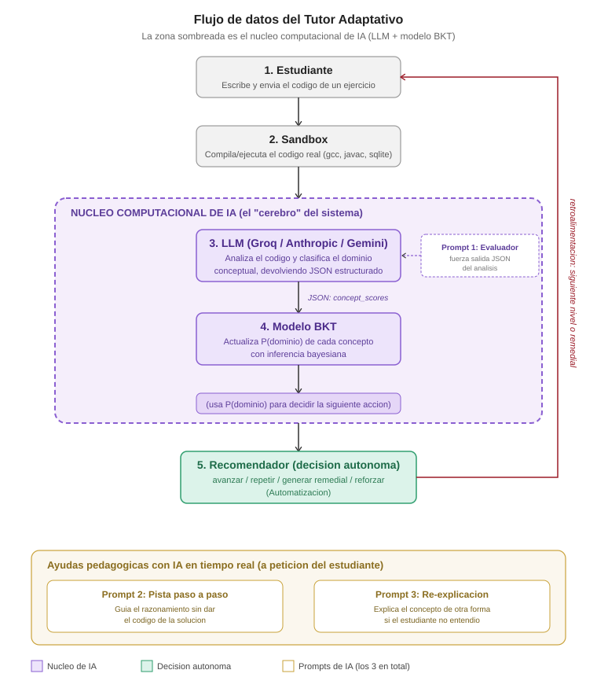

# Fundamentos de Inteligencia Artificial — Summer Camp 2026
## Tutor Adaptativo de Fundamentos de Programación

**Autor:** César (Amo)
**Modalidad:** Individual
**Fecha límite:** 28 de agosto de 2026 (supletorio 29 de agosto)

---

## 1. Definición del Problema

### 1.1 Contexto

Cuando una persona aprende un lenguaje de programación nuevo, o repasa
fundamentos, normalmente solo recibe una señal binaria de retroalimentación:
el ejercicio "pasó" o "no pasó" los tests. Esa señal no dice **por qué**
falló ni **qué concepto específico** no domina (¿fue un error de sintaxis,
o realmente no entiende recursión? ¿el problema fue con punteros o con
JOINs?).

Como consecuencia, la práctica se vuelve ineficiente: la persona repite
ejercicios que ya domina (falsa sensación de progreso) y evita, sin saberlo,
los conceptos donde realmente tiene brechas.

### 1.2 Impacto

Este problema es real y medible en el propio Summer Camp y en la carrera:
la curva de aprendizaje de fundamentos (variables, control de flujo,
funciones, estructuras de datos, punteros/memoria, POO, consultas
declarativas) es la base de *todo* lo que viene después (estructuras de
datos avanzadas, algoritmos, bases de datos, ciberseguridad). Un
estudiante con huecos conceptuales sin diagnosticar arrastra ese déficit
durante semestres.

### 1.3 Solución propuesta

Un **tutor adaptativo tipo videojuego (RPG)** que:
1. Presenta ejercicios organizados por "mundos" (lenguajes) y "niveles"
   (conceptos, de básico a avanzado), cada uno con una **lección completa
   escrita para cero conocimiento previo** (analogía + ejemplo resuelto
   aparte del ejercicio a resolver).
2. Usa un **LLM como núcleo computacional** para analizar el código que
   el estudiante escribe —no solo si el resultado es correcto, sino si
   el código *demuestra* comprensión del concepto evaluado.
3. Mantiene un **modelo probabilístico de dominio por concepto**
   (Bayesian Knowledge Tracing) que se actualiza con cada intento.
4. **Decide y genera contenido de forma autónoma**: avanza al estudiante,
   lo hace repetir, genera dinámicamente un ejercicio remedial, o
   **re-explica la lección de una forma distinta en vivo** si el
   estudiante no entendió la explicación original (botón "No entendí,
   explícamelo diferente").

### 1.4 Alcance del prototipo (justificación de viabilidad)

Dado el plazo (2 semanas, trabajo individual), el alcance se define así:

| Componente | Alcance en el prototipo |
|---|---|
| Motor (engine) | Genérico, funciona para cualquier lenguaje |
| Lenguajes jugables | **Python, C, Java y SQL** — cuatro paradigmas distintos: dinámico, manejo manual de memoria, orientado a objetos con tipado estático, y declarativo (SQL fuerza al motor a probarse contra un tipo de evaluación completamente distinto a los otros tres) |
| Niveles por lenguaje | **8** (de fundamentos a "jefe final"), con currícula verificada |
| Roadmap documentado | Los 6 lenguajes restantes del top-10 (C++, C#, TypeScript, Go, PHP, JavaScript) quedan como extensión futura sobre el mismo motor genérico |

Este recorte (4 en vez de 10, con 8 niveles de profundidad real en vez de
5 superficiales) es deliberado: demuestra que el motor **generaliza** a
paradigmas realmente distintos (criterio de "Defensa y Justificación"),
en vez de prometer una cobertura amplia sin evidencia de que funciona.

---

## 2. Resultado de IA que genera la solución

Este proyecto cubre **dos** de los resultados válidos definidos en el
alcance del Summer Camp simultáneamente:

- **Personalización:** el contenido y la ruta de aprendizaje se adaptan
  dinámicamente al perfil de dominio de cada estudiante.
- **Automatización:** el sistema decide de forma autónoma (sin
  intervención humana) qué acción tomar después de cada intento, y genera
  contenido nuevo (ejercicios remediales) cuando es necesario.

La IA **no es un asistente de ideación ni un chat pegado en un documento**:
procesa datos generados en tiempo de ejecución (el código real que escribe
el estudiante) y su salida estructurada alimenta directamente un segundo
modelo computacional (BKT), que a su vez determina el comportamiento del
sistema. Esto cumple explícitamente el criterio "la IA debe ser el núcleo
computacional de la solución" del documento de alcance.

---

## 3. Arquitectura de Implementación

### 3.1 Flujo de datos

```
Estudiante (código o consulta SQL)
        │
        ▼
   Sandbox ──────────► verifica corrección funcional (estrategia por lenguaje, ver 3.3)
        │
        ▼
   LLM (Claude / Gemini) ──► clasifica dominio conceptual (JSON estructurado)
        │
        ▼
   Modelo BKT ──────────► actualiza P(dominio) por concepto
        │
        ▼
   Recomendador ────────► decide: avanzar / reintentar / remedial / refuerzo
        │
        ▼
   (si remedial) Generador de ejercicios (LLM) ──► nuevo ejercicio dinámico
        │
        └──────────── vuelve al Estudiante con el siguiente nivel
```

*(Diagrama visual entregado por separado junto con este documento, ver `docs/arquitectura.svg`.)*



### 3.2 Componentes técnicos

| Módulo | Responsabilidad |
|---|---|
| `content/{lenguaje}.json` | Currícula: teoría, enunciados y tests/harness por nivel (8 por lenguaje) |
| `src/sandbox.py` | Ejecuta la solución del estudiante y verifica corrección — estrategia distinta por lenguaje (ver 3.3) |
| `src/llm_judge.py` | **Núcleo de IA.** Llama a la API de un LLM para clasificar el dominio conceptual del código en JSON estructurado |
| `src/exercise_generator.py` | Genera ejercicios remediales nuevos con el LLM cuando el dominio de un concepto es bajo |
| `src/mastery.py` | Modelo de Bayesian Knowledge Tracing: mantiene P(dominio) por concepto y niveles completados por estudiante |
| `src/recommender.py` | Motor de decisión: recibe el estado de mastery y decide la siguiente acción |
| `src/app.py` | **Interfaz principal (Streamlit).** Mapa de niveles jugable, editor de código, feedback de IA en vivo |
| `src/game.py` | Interfaz de consola alternativa, más ligera, mismo motor |

### 3.3 Estrategia de verificación por lenguaje

Cada lenguaje se prueba de la forma que le es natural, no con un molde
forzado a los 4:

| Lenguaje | Cómo se verifica | Estado de verificación |
|---|---|---|
| Python | Se evalúa una expresión (`call`) y se compara contra el valor esperado | ✅ 8/8 niveles probados con soluciones de referencia reales |
| C | Cada nivel trae un `harness_main` en C real que se compila junto al código del estudiante (gcc) y se compara el stdout exacto | ✅ 8/8 niveles compilados y ejecutados con gcc real, stdout verificado |
| Java | Mismo patrón que C pero con `javac`/`java` (el código del estudiante se inserta dentro de una clase `Main`) | ⚠️ Escrito y revisado, pero **no ejecutado** en el entorno donde se construyó este prototipo (solo tenía JRE, sin JDK completo). Antes de tu defensa, corre `javac` real en tu máquina para confirmar — ver sección 7 |
| SQL | La consulta del estudiante corre sobre una base SQLite en memoria (sembrada con el `schema` del nivel) y se compara el conjunto de filas resultante | ✅ 8/8 niveles probados con `sqlite3` (librería estándar de Python, sin dependencias externas) |

### 3.4 Integraciones externas

- **API de LLM:** intercambiable entre tres proveedores, configurable
  desde la barra lateral de la app (o por variable de entorno
  `LLM_PROVIDER`):
  - **Groq** (`GROQ_API_KEY`, console.groq.com/keys) — modelos abiertos
    (ej. `openai/gpt-oss-120b`) corriendo en hardware LPU, muy rapido y
    con capa gratuita generosa. Es el proveedor usado en la practica del
    Summer Camp.
  - **Anthropic** (`ANTHROPIC_API_KEY`) — Claude, soporta modelos como
    `claude-sonnet-5` o `claude-fable-5`.
  - **Google AI Studio / Gemini** (`GOOGLE_API_KEY`).

  Nota: Fable (Claude) es exclusivo de Anthropic; no esta disponible via
  Groq ni Google AI Studio, cada proveedor aloja sus propios modelos.
- **Ejecución de código:** `python3`, `gcc` y `javac`/`java` como runners
  nativos del sistema operativo, invocados vía `subprocess` con timeout
  de seguridad. SQL no requiere ningún runner externo (usa `sqlite3` de
  la librería estándar de Python).

### 3.5 Por qué es una "Implementación Válida" y no "Uso Superficial"

- No es transcripción de un chatbot: el LLM se llama mediante API con un
  prompt de sistema fijo y salida forzada a JSON, integrada directamente
  en la lógica del programa.
- No es un script `if/else` estático: la decisión de avanzar/reforzar se
  basa en probabilidades continuas actualizadas con inferencia bayesiana
  (BKT), no en umbrales fijos triviales.
- El código generado por IA (este mismo prototipo) sí procesa datos
  cognitivos en tiempo real: cada ejecución llama al LLM con el código
  real que el estudiante acaba de escribir.
- La app (Streamlit) fue probada de punta a punta con el framework
  oficial de testing de Streamlit (`AppTest`), no solo revisada a ojo:
  flujo completo de Python y de SQL ejecutado sin excepciones, incluyendo
  el mapa de niveles actualizándose correctamente tras cada envío.
- **Verificación en vivo con LLM real:** se probó end-to-end con Gemini
  (`gemini-3.6-flash`) resolviendo el nivel de punteros en C. La IA
  identificó correctamente y por su nombre el concepto evaluado
  ("desreferenciación de punteros"), confirmando que el análisis es
  real y específico al código enviado, no una respuesta genérica.

### 3.6 Nota sobre los tres proveedores probados

Durante las pruebas en la VM de desarrollo se probaron los tres
proveedores soportados, con resultados distintos que vale la pena
documentar (y son un buen tema para la sección de Defensa):

| Proveedor | Resultado |
|---|---|
| Groq | Conexión externa (`curl`, script standalone) funcionaba, pero dentro de la app fallaba de forma intermitente con `Connection error`. Probablemente un problema de red NAT de la VM, no del código (la misma llamada exacta funcionaba fuera de Streamlit). |
| Anthropic | No se llegó a probar en esta VM (se generó por error una key de Groq en su lugar). |
| Gemini | **Funcionando y verificado end-to-end**, con feedback conceptual real y específico. |

Esto es una ventaja de haber diseñado el sistema con proveedor
intercambiable (`LLM_PROVIDER`) desde el inicio: un fallo de conectividad
con un proveedor no bloquea el proyecto.

---

## 4. Uso de la IA como Copiloto (registro de desarrollo)

> Esta sección se llena de forma continua durante el desarrollo, como
> exige la rúbrica (10%). Ver plantilla detallada en
> `docs/registro_prompts.md`. Resumen:

- **Modelo(s) utilizados como copiloto de desarrollo:** Claude (Anthropic),
  versión Sonnet 5, vía claude.ai.
- **Uso:** diseño de arquitectura, generación del motor (BKT, sandbox
  multi-lenguaje, integración LLM, recomendador), generación y
  verificación de contenido curricular (32 niveles en total), y la
  interfaz Streamlit.
- **Prompts principales:** registrados en `docs/registro_prompts.md` con
  fecha, prompt resumido y qué bloqueo resolvió.

*Nota importante:* el LLM usado **como copiloto de desarrollo** (para
escribir este código) es distinto —conceptualmente— del LLM que la
**aplicación usa en tiempo de ejecución** (`llm_judge.py`) para evaluar
al estudiante. Ambos deben documentarse por separado; no confundirlos en
la defensa.

---

## 5. Mapeo directo a la rúbrica de evaluación

| Criterio | Peso | Cómo lo cubre este proyecto |
|---|---|---|
| 1. Definición del Problema | 15% | Sección 1: problema real, impacto medible, alcance justificado |
| 2. Integración de Resultados IA | 35% | Sección 2: Personalización + Automatización simultáneas, con evidencia técnica de que la IA es el núcleo |
| 3. Implementación Técnica | 30% | Motor funcional probado con ejecución real (Python/C/SQL) y app Streamlit probada con `AppTest`; arquitectura sin errores críticos; corre en 4 paradigmas distintos |
| 4. Documentación y Copiloto | 10% | Este documento + `registro_prompts.md` |
| 5. Defensa y Justificación | 10% | Secciones 1.4, 3.3 y 3.5 anticipan las preguntas típicas de defensa (por qué BKT y no un promedio simple, por qué 4 lenguajes y no 10, por qué SQL cuenta como "lenguaje" con paradigma distinto, por qué es "núcleo" y no "uso superficial") |

---

## 6. Cómo ejecutar el prototipo

### Interfaz visual (recomendada para la demo/defensa)

```bash
pip install -r requirements.txt --break-system-packages
streamlit run src/app.py
```

Se abre en el navegador. Desde la barra lateral configuras tu nombre, el
mundo (lenguaje), y tu API key (Anthropic o Google AI Studio) — sin la
key, el sistema sigue funcionando en modo *fallback* documentado (solo
tests, sin análisis conceptual real, pero nunca se cae).

### Interfaz de consola (alternativa ligera)

```bash
export ANTHROPIC_API_KEY="tu_api_key"   # o GOOGLE_API_KEY + LLM_PROVIDER=gemini

python src/game.py --lang python
python src/game.py --lang c
python src/game.py --lang java
python src/game.py --lang sql
```

---

## 7. Trabajo pendiente antes de entrega (28 de agosto)

- [ ] Conseguir API key (Groq, Anthropic o Google AI Studio) y probar el
      flujo completo con el LLM real (no solo en modo fallback) — hazlo
      desde la barra lateral de la app.
- [ ] **Importante:** correr `javac -version` en tu máquina. Si no tienes
      un JDK completo (solo JRE, como el entorno donde se construyó
      esto), instala uno (`sudo apt install default-jdk` en Ubuntu, o el
      instalador de Oracle/Adoptium en Windows) y prueba los 8 niveles
      de Java al menos una vez antes de la defensa.
- [ ] Completar `docs/registro_prompts.md` con los prompts reales usados
      durante el desarrollo.
- [ ] Grabar/preparar la defensa oral usando la sección 5 como guion.
